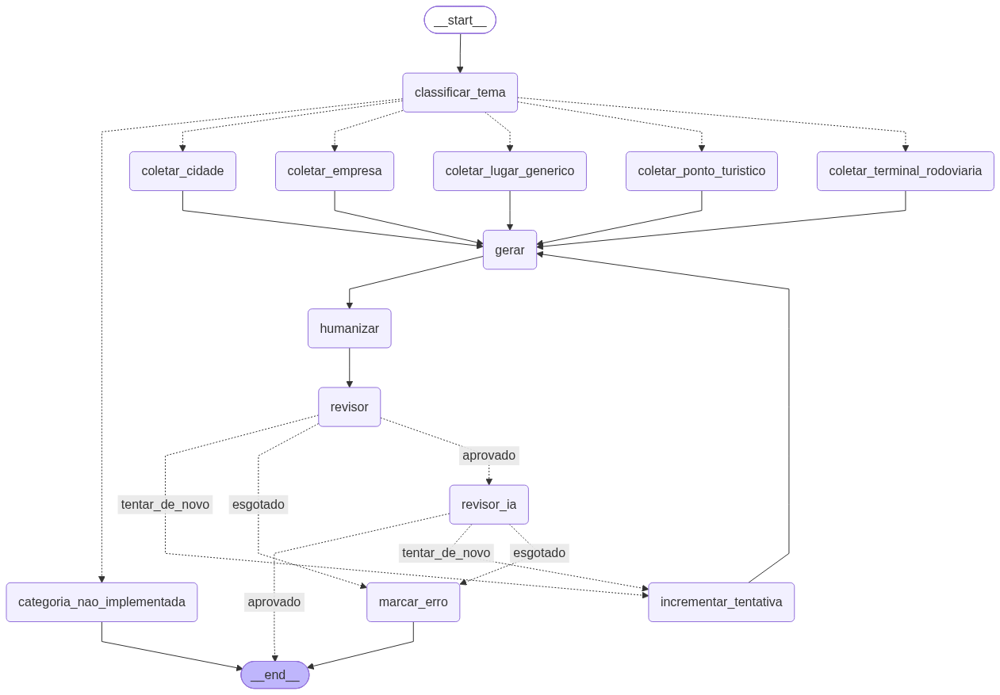

# Grafo de geração de descrições

Visualização do grafo implementado em [`grafo_descricao.py`](../grafo_descricao.py) (uma pasta acima). A imagem abaixo (`grafo_descricao.png`) e o código-fonte do diagrama (`grafo_descricao.mmd`) foram gerados direto do grafo compilado (`_GRAFO.get_graph().draw_mermaid()` / `draw_mermaid_png()`) — não são um desenho à mão, então qualquer mudança nos nós/arestas do código é refletida aqui só rodando de novo o comando no final deste arquivo.



## Como ler

- **Só a coleta é ramificada por categoria** (`coletar_cidade`, `coletar_empresa`, `coletar_ponto_turistico`, `coletar_terminal_rodoviaria`) — cada uma chama seu `base_*.py` correspondente. Categorias sem coletor implementado (`estado`, `país`, `evento`, `lugar_genérico`) caem em `categoria_nao_implementada`, que só levanta `NotImplementedError` (a aresta pro `__end__` existe só porque todo nó do LangGraph precisa levar a algum lugar — na prática a exceção sobe antes disso).
- **`gerar` → `humanizar` → `revisor` → `revisor_ia` são nós únicos**, compartilhados por qualquer categoria que chegue até eles — assim como o humanizador já funciona hoje (roda pra toda descrição, não só empresa).
- **Dois revisores em sequência, barato primeiro:**
  - `revisor` — determinístico, sem LLM. Confere palavra banida, contagem de palavras, e duas checagens condicionais: passagem/viagem (só se a categoria for empresa) e estrutura de 3-4 parágrafos (só se o tom for vendas). Roda sempre, de graça.
  - `revisor_ia` — só roda se o `revisor` já tiver aprovado (não gasta uma chamada de IA em texto que já ia ser reprovado de graça). Julga **só o TOM** do texto (soa como vendas/informativo/promocional mesmo?) — não recebe o template/instruções de geração, de propósito: dar o template inteiro fazia ele também tentar julgar regra estrutural/de conteúdo, que já é papel do determinístico, e às vezes de forma equivocada (ex: achar que dois parágrafos já separados por linha em branco estavam "misturados"). Restringir o escopo dele a só tom deixou a taxa de reprovação bem mais baixa e mais previsível.
- **O único ciclo do grafo** é `(revisor ou revisor_ia) -- tentar_de_novo --> incrementar_tentativa --> gerar`: se qualquer um dos dois reprovar e ainda houver tentativas sobrando (teto de 3, em `MAX_TENTATIVAS`), o texto é gerado de novo do zero — passando pelos dois revisores de novo. Se reprovar 3x seguidas, cai em `marcar_erro` e sai com o campo `erro` preenchido em vez de um texto.
- **O `revisor_ia` não é 100% consistente entre chamadas** (é um julgamento por LLM, não uma regra fixa) — na prática, o mesmo tipo de frase pode ser aprovado numa rodada e reprovado em outra. É o motivo de ele rodar só depois do determinístico e ter escopo restrito a tom: o que é checável por regra exata fica garantido; o resto fica sujeito a julgamento, com o teto de tentativas evitando loop infinito quando ele fica preso reprovando a mesma coisa repetidas vezes.

## Como regenerar

Rodar a partir de `formatos/descricao/` (onde `grafo_descricao.py` fica, pra importar certo), salvando dentro desta subpasta:

```bash
python -c "from grafo_descricao import _GRAFO; \
    open('explicacao_descricao_grafo/grafo_descricao.mmd', 'w', encoding='utf-8').write(_GRAFO.get_graph().draw_mermaid()); \
    open('explicacao_descricao_grafo/grafo_descricao.png', 'wb').write(_GRAFO.get_graph().draw_mermaid_png())"
```

(`draw_mermaid_png()` usa a API pública do mermaid.ink pra renderizar — precisa de internet; `draw_mermaid()` sozinho já dá o texto do diagrama, sem depender de rede.)
